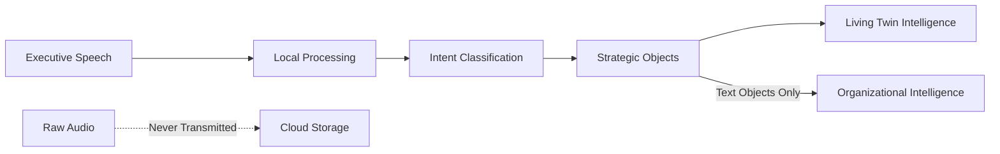

# Living Twin: Information Flow and Fundamental Concepts

## Executive Summary

The Living Twin represents a paradigm shift from traditional business intelligence systems to conversational strategic intelligence. Rather than forcing executives to adapt to software interfaces, the system adapts to natural executive communication patterns through voice-first interaction, extracting strategic insights without compromising privacy or security.

## The Typing Friction Problem

**The Reality**: Executives think strategically in complex, interconnected ways. A typical strategic query might be: *"Tell me about the competitive implications of M07 in relation to our Nordic expansion timeline, resource allocation constraints, and Sarah's catchball about team readiness."*

**The Challenge**: Typing this creates cognitive overhead - executives must context-switch between strategic thinking and text input mechanics. Voice eliminates this friction, keeping leaders in strategic thinking mode.

**The Solution**: Natural speech input that extracts strategic intelligence objects, not audio files.

## Core Information Flow Architecture

### 1. Voice Input → Strategic Objects (Not Audio Files)



**What We Capture**:
- Strategic intent and context
- Decision nudges and recommendations  
- Command structures and priorities
- Organizational pulse indicators

**What We Never Store**:
- Raw audio files
- Complete conversation transcripts
- Executive voice patterns
- Sensitive verbal exchanges

### 2. Strategic Object Structure

```json
{
  "strategic_insight": {
    "timestamp": "2024-08-24T15:30:41Z",
    "executive_id": "ceo_001",
    "session_thread": "nordic_expansion_m07",
    "concept_type": "catchball_escalation",
    "extracted_intent": {
      "primary_concern": "Nordic resource allocation",
      "urgency_level": "high", 
      "stakeholders": ["sarah_team_lead", "leadership_team"],
      "decision_nudge": "schedule_resource_review",
      "context_threads": ["m07_competitive_analysis", "team_readiness_assessment"]
    },
    "organizational_impact": {
      "pulse_indicator": "resource_strain_detected",
      "strategic_alignment": "partially_aligned",
      "wisdom_crowd_input": "team_capacity_concern"
    }
  }
}
```

## Fundamental Concepts

### 1. CatchBall System

**Concept**: Strategic concerns "thrown" up from operational levels that need executive attention.

**Voice Pattern Recognition**:
- *"Sarah mentioned concerns about..."*
- *"The team is struggling with..."*  
- *"We're seeing pushback on..."*

**Information Flow**:
```
Operational Team → CatchBall → Executive Awareness → Strategic Response
```

**Strategic Object Output**:
```json
{
  "concept_type": "catchball",
  "originator": "sarah_team_lead",
  "concern_category": "resource_allocation",
  "escalation_level": "executive_attention_required",
  "suggested_actions": ["schedule_one_on_one", "resource_audit", "timeline_review"]
}
```

### 2. Wisdom of the Crowd

**Concept**: Collective intelligence from across the organization that informs strategic decisions.

**Voice Pattern Recognition**:
- *"The consensus from the team is..."*
- *"Everyone's saying..."*
- *"The general feeling is..."*

**Information Flow**:
```
Distributed Insights → Pattern Recognition → Collective Wisdom → Strategic Guidance
```

**Strategic Object Output**:
```json
{
  "concept_type": "wisdom_of_crowd",
  "insight_source": "distributed_team_input",
  "consensus_level": "strong_agreement",
  "strategic_implication": "market_timing_optimal", 
  "confidence_score": 0.85,
  "supporting_voices": ["product_team", "sales_team", "customer_success"]
}
```

### 3. Strategic Alignment

**Concept**: Continuous calibration between organizational actions and strategic objectives.

**Voice Pattern Recognition**:
- *"This aligns with our..."*
- *"This seems off-track from..."*
- *"We need to course-correct..."*

**Information Flow**:
```
Current Actions → Alignment Assessment → Strategic Objectives → Nudge Generation
```

**Strategic Object Output**:
```json
{
  "concept_type": "strategic_alignment",
  "current_state": "partially_aligned",
  "target_state": "fully_aligned", 
  "gap_analysis": ["resource_reallocation", "timeline_adjustment"],
  "nudge_priority": "immediate_attention",
  "alignment_score": 0.72
}
```

### 4. Five-Minute Conversation Framework

**Concept**: Structured conversational boundaries that prevent meandering while capturing strategic depth.

**Voice Constraints as Features**:
- **Hook 1**: Current situation assessment
- **Hook 2**: Challenge identification  
- **Hook 3**: Strategic options evaluation
- **Hook 4**: Decision recommendation
- **Hook 5**: Next actions clarification

**Information Flow**:
```
Natural Speech → 5-Hook Structure → Strategic Clarity → Action Items
```

**Strategic Object Output**:
```json
{
  "concept_type": "five_minute_conversation",
  "conversation_id": "nordic_expansion_review",
  "hooks_completed": [1, 2, 3, 4, 5],
  "strategic_clarity": "high",
  "decision_quality": "executive_ready",
  "action_items": [
    {
      "action": "resource_audit",
      "owner": "sarah_team_lead", 
      "deadline": "2024-08-28",
      "priority": "high"
    }
  ]
}
```

### 5. Organizational Twin

**Concept**: A digital mirror of organizational intelligence, patterns, and strategic context.

**Voice-Powered Capabilities**:
- **Context Persistence**: Remember strategic threads across sessions
- **Pattern Recognition**: Identify recurring organizational themes
- **Proactive Nudging**: Surface relevant insights during conversations
- **Strategic Memory**: Maintain long-term organizational context

**Information Flow**:
```
Voice Input → Context Analysis → Organizational Memory → Intelligent Responses
```

**Strategic Object Output**:
```json
{
  "concept_type": "organizational_twin",
  "context_threads": [
    {
      "thread_id": "m07_competitive_response",
      "started": "2024-08-21", 
      "last_activity": "2024-08-24",
      "participants": ["ceo_001", "sarah_team_lead"],
      "strategic_status": "active_monitoring"
    }
  ],
  "organizational_pulse": {
    "current_focus": "nordic_expansion",
    "stress_indicators": ["resource_allocation", "timeline_pressure"],
    "momentum_areas": ["market_opportunity", "team_engagement"]
  }
}
```

## Conversational Flow Patterns

### Non-Linear Executive Thinking

**Scenario**: *"I want to discuss M07... actually, did you see Sarah's catchball about team capacity? That might affect our Nordic timeline. Let me circle back to M07 competitive positioning after we address the resource question."*

**System Response**:
1. **Thread Management**: Maintain multiple active conversation threads
2. **Context Switching**: Seamlessly move between strategic topics
3. **Memory Persistence**: Remember incomplete threads for later continuation
4. **Relationship Mapping**: Connect related strategic elements

### Strategic Interruption Handling

**Executive Pattern**: Strategic conversations are naturally interrupted by:
- New information arrival
- Related concern remembrance  
- Priority shifts
- Time constraints

**System Capability**:
```python
class ConversationStateManager:
    def handle_interruption(self, new_input, current_thread):
        # Pause current thread with context preservation
        # Evaluate new input priority
        # Create new thread or escalate current
        # Maintain relationship mapping between threads
        pass
    
    def resume_thread(self, thread_id, context):
        # Restore previous conversation state
        # Provide relevant context summary
        # Continue from interruption point
        pass
```

## Privacy-First Architecture

### What Gets Processed Locally
- **Wake word detection**
- **Voice activity detection** 
- **Basic transcription**
- **Initial intent classification**

### What Gets Transmitted (Text Objects Only)
```json
{
  "strategic_intent": "resource_allocation_concern",
  "context": "nordic_expansion_m07",
  "urgency": "high",
  "stakeholders": ["sarah_team_lead"],
  "recommended_actions": ["schedule_review"]
}
```

### What Never Leaves the Device
- Raw audio files
- Complete conversation transcripts
- Voice patterns or biometrics
- Sensitive verbal exchanges

## Voice Interface Advantages

### 1. Cognitive Efficiency
- **No Context Switching**: Stay in strategic thinking mode
- **Natural Expression**: Speak complex queries naturally
- **Reduced Friction**: Eliminate typing overhead
- **Multitasking Capable**: Use while walking, driving, in meetings

### 2. Strategic Depth
- **Complex Query Support**: Handle multi-dimensional strategic questions
- **Context Preservation**: Maintain conversational threads across sessions
- **Relationship Mapping**: Understand interconnected strategic elements
- **Nuanced Communication**: Capture urgency, priority, and emotional context

### 3. Executive Workflow Integration
- **Meeting Compatibility**: Quick strategic check-ins during meetings
- **Mobile Accessibility**: Full functionality on mobile devices
- **Interruption Recovery**: Resume strategic discussions seamlessly
- **Time Efficiency**: 5-minute strategic conversations vs 30-minute typing sessions

## Implementation Constraints as Features

### 1. Five-Hook Boundary System
**Purpose**: Prevent conversational meandering while ensuring strategic depth

**Voice Implementation**:
- Visual progress indicators during conversation
- Natural transition prompts between hooks
- Automatic summarization at hook completion
- Option to extend or conclude at any hook

### 2. Character Limits for Strategic Objects
**Purpose**: Force clarity and prioritization in strategic communication

**Voice Translation**:
- Verbose speech → Concise strategic objects
- Rambling concerns → Structured decision nudges
- Complex discussions → Actionable insights

### 3. Visual Hierarchy for Voice Output
**Purpose**: Present strategic insights in scannable, actionable format

**Voice-to-Visual Translation**:
```
Voice Input: "I'm concerned about Nordic resource allocation affecting M07 timeline"
↓
Visual Output:
🔴 HIGH PRIORITY
📍 Nordic Resource Allocation
🎯 Impact: M07 Timeline
👥 Stakeholder: Sarah (Team Lead)
⚡ Action: Schedule Resource Review
```

## Future Evolution: Voice-First Strategic Intelligence

### 1. Ambient Strategic Intelligence
- **Always Listening**: Wake word activation for strategic discussions
- **Context Awareness**: Understand meeting vs personal reflection mode
- **Proactive Insights**: Surface relevant information during conversations

### 2. Multi-Modal Integration
- **Voice + Visual**: Speak queries, see structured results
- **Voice + Documents**: Reference documents through speech
- **Voice + Data**: Query business metrics conversationally

### 3. Organizational Voice Training
- **Domain Adaptation**: Learn company-specific terminology
- **Strategic Pattern Recognition**: Understand organizational communication patterns
- **Cultural Adaptation**: Adapt to regional and cultural communication styles

## Success Metrics

### Technical Performance
- **Transcription Accuracy**: >95% for executive speech patterns
- **Intent Classification**: >90% accuracy for strategic concepts
- **Response Latency**: <500ms from speech to strategic object
- **Context Continuity**: 100% thread persistence across sessions

### Business Impact
- **Decision Velocity**: Time from strategic question to actionable insight
- **Strategic Clarity**: Quality of extracted decision nudges
- **Executive Adoption**: Daily active usage by strategic decision makers
- **Organizational Intelligence**: Quality of crowd wisdom and catchball processing

---

*The Living Twin transforms voice into strategic intelligence, creating a new paradigm where technology adapts to executive thinking patterns rather than forcing executives to adapt to software interfaces.*
