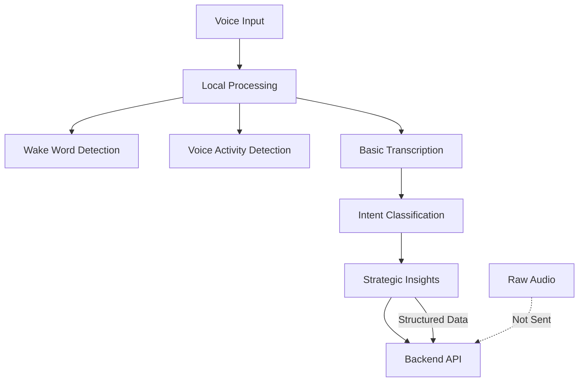

# Speech Implementation Plan for Living Twin

## Overview

This document outlines a comprehensive speech implementation strategy for the Living Twin system, focusing on extracting strategic intelligence from voice interactions rather than high-fidelity audio processing. The architecture prioritizes strategic intent classification over audio quality, enabling real-time organizational intelligence gathering.

## Technology Stack Recommendations

### Core Speech Technologies

| Technology | Use Case | Strengths | Implementation Priority |
|------------|----------|-----------|------------------------|
| **OpenAI Whisper** | Primary transcription | High accuracy, local processing option | High |
| **Azure Speech Services** | Real-time streaming | Low latency, enterprise-grade | Medium |
| **Google Speech-to-Text** | Multilingual support | Nordic language support | High |
| **Assembly AI** | Conversation intelligence | Speaker diarization, topic detection | Medium |

### Processing Architecture



## Step-by-Step Implementation Process

### Phase 1: Foundation Setup (Week 1-2)

#### ✅ Step 1: Define Intent Classification Schema

Create a structured taxonomy for strategic intents:

```yaml
strategic_intents:
  market_intelligence:
    - competitor_analysis
    - market_trend_observation
    - customer_feedback
  
  catchballs:
    - resource_allocation_concerns
    - timeline_adjustments
    - quality_issues
  
  wisdom_of_crowd:
    - team_insights
    - process_improvements
    - innovation_ideas
  
  escalation_requests:
    - leadership_attention
    - urgent_decisions
    - critical_issues
```

#### ✅ Step 2: Design Conversation State Architecture

```python
class ConversationState:
    """Manages strategic conversation threads across sessions"""
    
    def __init__(self):
        self.strategic_threads = {}
        self.session_context = {}
        self.organizational_pulse = {}
    
    def persist_strategic_thread(self, thread_id: str, context: dict):
        """Persist strategic conversations across sessions"""
        pass
    
    def retrieve_context(self, user_id: str, topic: str) -> dict:
        """Retrieve conversation context for continuity"""
        pass
```

#### ✅ Step 3: Set Up Data Pipeline Schema

Define how strategic insights are structured:

```json
{
  "insight_id": "uuid",
  "timestamp": "iso_datetime",
  "user_id": "string",
  "conversation_thread": "thread_id",
  "strategic_category": "market_intelligence|catchballs|wisdom_of_crowd|escalation",
  "intent": "specific_intent_type",
  "confidence_score": 0.85,
  "extracted_entities": {
    "topics": ["M07", "Nordic_expansion"],
    "urgency_level": "high|medium|low",
    "stakeholders": ["leadership", "team_leads"],
    "action_items": ["schedule_review", "allocate_resources"]
  },
  "context": {
    "previous_thread_id": "uuid",
    "related_insights": ["uuid1", "uuid2"]
  }
}
```

### Phase 2: Local Processing Implementation (Week 3-4)

#### ✅ Step 4: Set Up Local Speech Processing

```python
# speech/local_processor.py
import whisper
from typing import Dict, Optional

class LocalSpeechProcessor:
    def __init__(self, model_size: str = "base"):
        self.model = whisper.load_model(model_size)
        self.confidence_threshold = 0.8
    
    def transcribe_with_confidence(self, audio_data: bytes) -> Dict:
        """Transcribe audio and return confidence scores"""
        result = self.model.transcribe(audio_data)
        
        return {
            "text": result["text"],
            "confidence": self._calculate_confidence(result),
            "segments": result.get("segments", []),
            "language": result.get("language", "en")
        }
    
    def should_process_remotely(self, confidence: float) -> bool:
        """Determine if remote processing is needed"""
        return confidence < self.confidence_threshold
```

#### ✅ Step 5: Implement Intent Classification Engine

```python
# speech/intent_classifier.py
import re
from typing import List, Dict
from dataclasses import dataclass

@dataclass
class IntentMatch:
    category: str
    intent: str
    confidence: float
    entities: Dict[str, List[str]]

class StrategicIntentClassifier:
    def __init__(self):
        self.patterns = self._load_patterns()
        self.entity_extractors = self._load_extractors()
    
    def classify(self, text: str, context: Dict) -> IntentMatch:
        """Classify strategic intent from transcribed text"""
        
        # Market intelligence patterns
        if self._match_pattern(text, self.patterns["market_intelligence"]):
            return self._create_market_intelligence_match(text)
        
        # Catchball patterns
        elif self._match_pattern(text, self.patterns["catchballs"]):
            return self._create_catchball_match(text)
        
        # Wisdom of crowd patterns
        elif self._match_pattern(text, self.patterns["wisdom_crowd"]):
            return self._create_wisdom_match(text)
        
        # Escalation patterns
        elif self._match_pattern(text, self.patterns["escalation"]):
            return self._create_escalation_match(text)
        
        return self._create_unknown_match(text)
    
    def _load_patterns(self) -> Dict:
        """Load domain-specific pattern matching rules"""
        return {
            "market_intelligence": [
                r"competitor.*(\w+).*market",
                r"customer.*feedback.*about",
                r"market.*trend.*(\w+)"
            ],
            "catchballs": [
                r"concern.*about.*(\w+)",
                r"resource.*allocation.*issue",
                r"timeline.*adjustment.*needed"
            ],
            "escalation": [
                r"escalate.*(\w+).*to.*leadership",
                r"need.*urgent.*decision.*on",
                r"critical.*issue.*with.*(\w+)"
            ]
        }
```

### Phase 3: Real-Time Processing Integration (Week 5-6)

#### ✅ Step 6: Implement Streaming Speech Processing

```python
# speech/streaming_processor.py
import azure.cognitiveservices.speech as speechsdk
from typing import Callable, Optional

class StreamingSpeechProcessor:
    def __init__(self, subscription_key: str, region: str):
        self.speech_config = speechsdk.SpeechConfig(
            subscription=subscription_key, 
            region=region
        )
        self.intent_classifier = StrategicIntentClassifier()
    
    def start_continuous_recognition(
        self, 
        on_intent_recognized: Callable[[IntentMatch], None]
    ):
        """Start continuous speech recognition for strategic intents"""
        
        speech_recognizer = speechsdk.SpeechRecognizer(
            speech_config=self.speech_config
        )
        
        def recognized_handler(evt):
            if evt.result.reason == speechsdk.ResultReason.RecognizedSpeech:
                text = evt.result.text
                intent = self.intent_classifier.classify(text, {})
                
                if intent.confidence > 0.7:
                    on_intent_recognized(intent)
        
        speech_recognizer.recognized.connect(recognized_handler)
        speech_recognizer.start_continuous_recognition()
```

### Phase 4: Conversation State Management (Week 7-8)

#### ✅ Step 7: Implement Strategic Thread Persistence

```python
# conversation/thread_manager.py
from typing import Dict, List, Optional
import uuid
from datetime import datetime

class StrategicThreadManager:
    def __init__(self, storage_backend):
        self.storage = storage_backend
        self.active_threads = {}
    
    def start_thread(self, user_id: str, initial_intent: IntentMatch) -> str:
        """Start a new strategic conversation thread"""
        thread_id = str(uuid.uuid4())
        
        thread = {
            "id": thread_id,
            "user_id": user_id,
            "started_at": datetime.utcnow().isoformat(),
            "category": initial_intent.category,
            "context": {
                "topics": initial_intent.entities.get("topics", []),
                "stakeholders": initial_intent.entities.get("stakeholders", [])
            },
            "intents": [initial_intent],
            "status": "active"
        }
        
        self.active_threads[thread_id] = thread
        self.storage.save_thread(thread)
        return thread_id
    
    def continue_thread(
        self, 
        user_id: str, 
        new_intent: IntentMatch
    ) -> Optional[str]:
        """Find and continue an existing strategic thread"""
        
        # Look for related active threads
        related_thread = self._find_related_thread(user_id, new_intent)
        
        if related_thread:
            related_thread["intents"].append(new_intent)
            related_thread["updated_at"] = datetime.utcnow().isoformat()
            self.storage.update_thread(related_thread)
            return related_thread["id"]
        
        # Start new thread if no related thread found
        return self.start_thread(user_id, new_intent)
```

### Phase 5: Error Handling & Fallbacks (Week 9-10)

#### ✅ Step 8: Implement Confidence-Based Error Handling

```python
# speech/error_handler.py
from enum import Enum
from typing import Dict, Optional

class ConfidenceLevel(Enum):
    HIGH = 0.8
    MEDIUM = 0.6
    LOW = 0.4

class SpeechErrorHandler:
    def __init__(self):
        self.fallback_strategies = {
            ConfidenceLevel.LOW: self._request_clarification,
            ConfidenceLevel.MEDIUM: self._request_confirmation,
            ConfidenceLevel.HIGH: self._proceed_with_processing
        }
    
    def handle_transcription(
        self, 
        result: Dict, 
        context: Dict
    ) -> Optional[str]:
        """Handle transcription based on confidence level"""
        
        confidence = result.get("confidence", 0.0)
        
        if confidence >= ConfidenceLevel.HIGH.value:
            return self._proceed_with_processing(result, context)
        elif confidence >= ConfidenceLevel.MEDIUM.value:
            return self._request_confirmation(result, context)
        else:
            return self._request_clarification(result, context)
    
    def _request_clarification(self, result: Dict, context: Dict) -> str:
        """Request user clarification for low confidence transcription"""
        return "I didn't catch that clearly. Could you please repeat your strategic point?"
    
    def _request_confirmation(self, result: Dict, context: Dict) -> str:
        """Request confirmation for medium confidence transcription"""
        text = result.get("text", "")
        return f"I heard: '{text}'. Is this correct?"
    
    def _proceed_with_processing(self, result: Dict, context: Dict) -> Optional[str]:
        """Process high confidence transcription"""
        return None  # Proceed with normal processing
```

### Phase 6: Multilingual Support (Week 11-12)

#### ✅ Step 9: Implement Nordic Language Support

```python
# speech/multilingual_processor.py
from typing import Dict, List
import google.cloud.speech as speech

class MultilingualProcessor:
    def __init__(self):
        self.supported_languages = {
            "sv-SE": "Swedish",
            "no-NO": "Norwegian", 
            "da-DK": "Danish",
            "en-US": "English"
        }
        self.client = speech.SpeechClient()
    
    def transcribe_multilingual(self, audio_data: bytes) -> Dict:
        """Transcribe audio with automatic language detection"""
        
        config = speech.RecognitionConfig(
            encoding=speech.RecognitionConfig.AudioEncoding.LINEAR16,
            sample_rate_hertz=16000,
            alternative_language_codes=list(self.supported_languages.keys()),
            enable_automatic_punctuation=True,
            enable_word_confidence=True
        )
        
        audio = speech.RecognitionAudio(content=audio_data)
        response = self.client.recognize(config=config, audio=audio)
        
        return self._process_multilingual_response(response)
    
    def _process_multilingual_response(self, response) -> Dict:
        """Process multilingual transcription response"""
        if not response.results:
            return {"text": "", "confidence": 0.0, "language": "unknown"}
        
        result = response.results[0]
        alternative = result.alternatives[0]
        
        return {
            "text": alternative.transcript,
            "confidence": alternative.confidence,
            "language": result.language_code,
            "words": [
                {
                    "word": word.word,
                    "confidence": word.confidence,
                    "start_time": word.start_time.total_seconds(),
                    "end_time": word.end_time.total_seconds()
                }
                for word in alternative.words
            ]
        }
```

### Phase 7: Testing Strategy Implementation (Week 13-14)

#### ✅ Step 10: Create Testing Framework

```python
# tests/speech_test_framework.py
import unittest
from typing import Dict, List
import json

class SpeechTestFramework:
    def __init__(self):
        self.test_scenarios = self._load_test_scenarios()
        self.expected_intents = self._load_expected_intents()
    
    def _load_test_scenarios(self) -> List[Dict]:
        """Load recorded test scenarios for strategic intents"""
        return [
            {
                "scenario_id": "market_intel_001",
                "audio_file": "tests/audio/market_intel_001.wav",
                "transcript": "I'm seeing strong competitor movement in the Nordic market, especially around M07",
                "expected_intent": {
                    "category": "market_intelligence",
                    "intent": "competitor_analysis",
                    "entities": {
                        "topics": ["M07", "Nordic_market"],
                        "urgency_level": "medium"
                    }
                }
            },
            {
                "scenario_id": "escalation_001", 
                "audio_file": "tests/audio/escalation_001.wav",
                "transcript": "We need to escalate the C12 resource allocation issue to leadership immediately",
                "expected_intent": {
                    "category": "escalation",
                    "intent": "leadership_attention",
                    "entities": {
                        "topics": ["C12", "resource_allocation"],
                        "urgency_level": "high",
                        "stakeholders": ["leadership"]
                    }
                }
            }
        ]
    
    def test_intent_accuracy(self, processor) -> Dict:
        """Test strategic intent extraction accuracy"""
        results = {
            "total_tests": len(self.test_scenarios),
            "passed": 0,
            "failed": 0,
            "accuracy_by_category": {}
        }
        
        for scenario in self.test_scenarios:
            result = processor.process_audio(scenario["audio_file"])
            expected = scenario["expected_intent"]
            
            if self._compare_intents(result, expected):
                results["passed"] += 1
            else:
                results["failed"] += 1
        
        results["accuracy"] = results["passed"] / results["total_tests"]
        return results
```

### Phase 8: Production Deployment (Week 15-16)

#### ✅ Step 11: Production Configuration

```yaml
# config/speech_production.yaml
speech_processing:
  local_processing:
    enabled: true
    model: "whisper-base"
    confidence_threshold: 0.8
    
  cloud_processing:
    primary: "azure"
    fallback: "google"
    azure:
      subscription_key: "${AZURE_SPEECH_KEY}"
      region: "westeurope"
    google:
      credentials_path: "${GOOGLE_CREDENTIALS_PATH}"
      
  intent_classification:
    confidence_threshold: 0.7
    fallback_to_human: true
    human_review_threshold: 0.5
    
  conversation_management:
    thread_timeout_hours: 72
    max_threads_per_user: 10
    persistence_backend: "redis"
    
  multilingual:
    enabled: true
    supported_languages: ["sv-SE", "no-NO", "da-DK", "en-US"]
    auto_detect: true
    
  privacy:
    store_audio: false
    store_transcripts: false
    store_insights: true
    retention_days: 90
```

#### ✅ Step 12: Monitoring and Analytics

```python
# monitoring/speech_analytics.py
from typing import Dict
import time
from dataclasses import dataclass

@dataclass
class SpeechMetrics:
    transcription_accuracy: float
    intent_accuracy: float
    processing_latency: float
    confidence_distribution: Dict[str, int]
    language_distribution: Dict[str, int]

class SpeechAnalytics:
    def __init__(self):
        self.metrics = SpeechMetrics(0.0, 0.0, 0.0, {}, {})
        self.processing_times = []
    
    def track_processing(self, start_time: float, result: Dict):
        """Track speech processing metrics"""
        end_time = time.time()
        latency = end_time - start_time
        
        self.processing_times.append(latency)
        self.metrics.processing_latency = sum(self.processing_times) / len(self.processing_times)
        
        # Track confidence distribution
        confidence = result.get("confidence", 0.0)
        confidence_bucket = self._get_confidence_bucket(confidence)
        self.metrics.confidence_distribution[confidence_bucket] = \
            self.metrics.confidence_distribution.get(confidence_bucket, 0) + 1
    
    def generate_report(self) -> Dict:
        """Generate analytics report for speech processing"""
        return {
            "performance": {
                "avg_latency_ms": self.metrics.processing_latency * 1000,
                "transcription_accuracy": self.metrics.transcription_accuracy,
                "intent_accuracy": self.metrics.intent_accuracy
            },
            "usage": {
                "confidence_distribution": self.metrics.confidence_distribution,
                "language_distribution": self.metrics.language_distribution
            },
            "recommendations": self._generate_recommendations()
        }
```

## Implementation Timeline

| Phase | Duration | Key Deliverables | Success Criteria |
|-------|----------|------------------|------------------|
| 1 | Week 1-2 | Intent schema, data pipeline | Clear taxonomy defined |
| 2 | Week 3-4 | Local processing setup | >80% transcription accuracy |
| 3 | Week 5-6 | Real-time streaming | <500ms processing latency |
| 4 | Week 7-8 | Conversation persistence | Thread continuity working |
| 5 | Week 9-10 | Error handling | Graceful failure handling |
| 6 | Week 11-12 | Multilingual support | Nordic languages supported |
| 7 | Week 13-14 | Testing framework | 90% intent accuracy |
| 8 | Week 15-16 | Production deployment | System live and monitored |

## Hardware Requirements

### Minimum Requirements
- **Mobile**: Modern smartphone (iOS 12+/Android 8+)
- **CPU**: ARM64 or x86_64 with hardware acceleration
- **RAM**: 4GB minimum for local Whisper processing
- **Storage**: 1GB for models and cache

### Recommended Requirements
- **Dedicated Hardware**: Raspberry Pi 4 or equivalent for enterprise
- **Edge Computing**: NVIDIA Jetson for advanced processing
- **Network**: Low-latency connection for real-time features

## Security and Privacy Considerations

### Data Processing
- ✅ **No raw audio storage** - Process and discard
- ✅ **Local transcription** when possible
- ✅ **Insight-only transmission** to backend
- ✅ **Encryption in transit** for all data
- ✅ **Configurable retention** policies

### Compliance
- ✅ **GDPR compliance** for EU markets
- ✅ **Executive privilege** considerations
- ✅ **Corporate security** requirements
- ✅ **Audit logging** for strategic decisions

## Success Metrics

### Technical Metrics
- **Transcription Accuracy**: >95% for clear speech
- **Intent Classification**: >90% accuracy for strategic categories
- **Processing Latency**: <500ms end-to-end
- **System Uptime**: 99.9% availability

### Business Metrics
- **Strategic Insight Quality**: Measured by executive feedback
- **Conversation Continuity**: Thread persistence across sessions
- **User Adoption**: Active voice usage rates
- **Decision Acceleration**: Time from insight to action

## Risk Mitigation

### Technical Risks
| Risk | Mitigation | Monitoring |
|------|-----------|------------|
| Poor audio quality | Multi-microphone arrays, noise cancellation | Audio quality metrics |
| Network latency | Local processing fallback | Latency monitoring |
| Intent misclassification | Human-in-the-loop validation | Accuracy tracking |
| Privacy concerns | Local-first processing | Privacy audit logs |

### Business Risks  
| Risk | Mitigation | Monitoring |
|------|-----------|------------|
| Executive resistance | Gradual rollout, clear benefits | User feedback |
| Compliance issues | Legal review, privacy-by-design | Compliance audits |
| Technical complexity | Phased implementation | Development metrics |
| Market timing | MVP approach, rapid iteration | User adoption rates |

## Next Steps

### Immediate Actions (Week 1)
1. ✅ Define strategic intent taxonomy
2. ✅ Set up development environment
3. ✅ Create data pipeline schemas
4. ✅ Begin local Whisper integration

### Short-term Goals (Month 1)
1. ✅ Complete local processing implementation
2. ✅ Implement basic intent classification
3. ✅ Create testing framework
4. ✅ Validate with sample conversations

### Long-term Vision (Months 2-6)
1. ✅ Production deployment with monitoring
2. ✅ Multilingual support for Nordic markets
3. ✅ Advanced conversation intelligence
4. ✅ Integration with broader Living Twin ecosystem

---

*This implementation plan prioritizes strategic intelligence extraction over audio processing perfection, aligning with the Living Twin's core mission of organizational intelligence and strategic decision support.*
